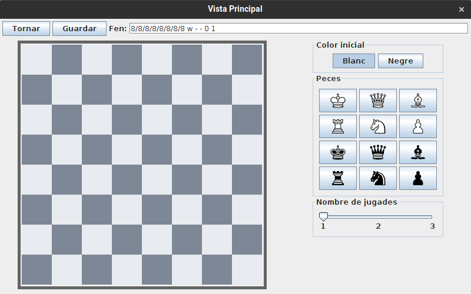
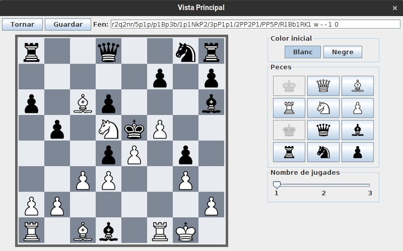
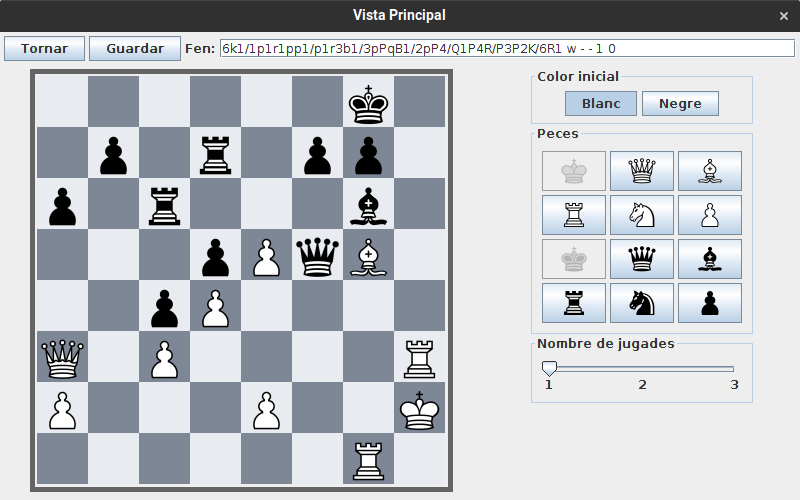
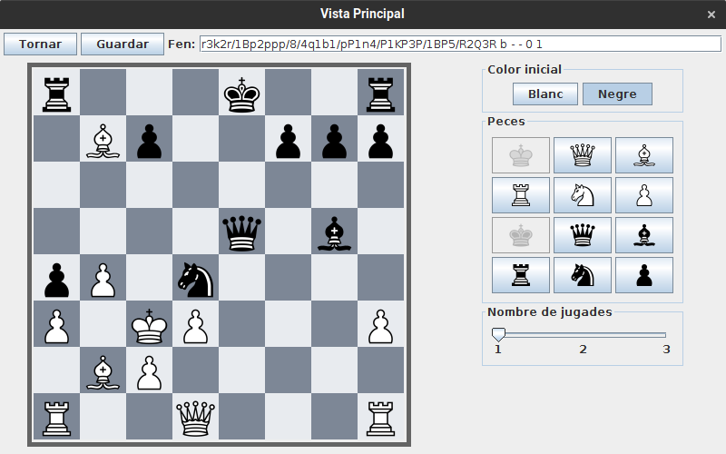
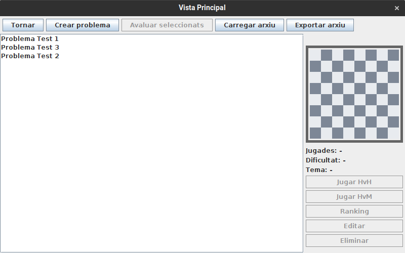

# JP1: Afegir problemes

## Tipus JP

Simple

## Efectes estudiats

Es poden afegir problemes a la base de dades.

## Entrada

Executar l'aplicació i entrar a Jugar -> Crear problema.

A la caixa de text superior introduir un a un els següents FEN i prémer enter per a veure el tauler.

Després d'introduir cada fen, seleccionar 2 com a nombre de jugades i prémer "Guardar".

Posar "Problema Test #" com a nom, on # és el número del fen introduit (1..3)

Llista de FENs a introduir:

```
r2q2nr/5p1p/p1Bp3b/1p1NkP2/3pP1p1/2PP2P1/PP5P/R1Bb1RK1 w - - 1 0
6k1/1p1r1pp1/p1r3b1/3pPqB1/2pP4/Q1P4R/P3P2K/6R1 w - - 1 0
r3k2r/1Bp2ppp/8/4q1b1/pP1n4/P1KP3P/1BP5/R2Q3R b - - 0 1
```

## Resposta esperada

Els problemes queden afegits a la llista de problemes.

## Captures de pantalla de la sortida










