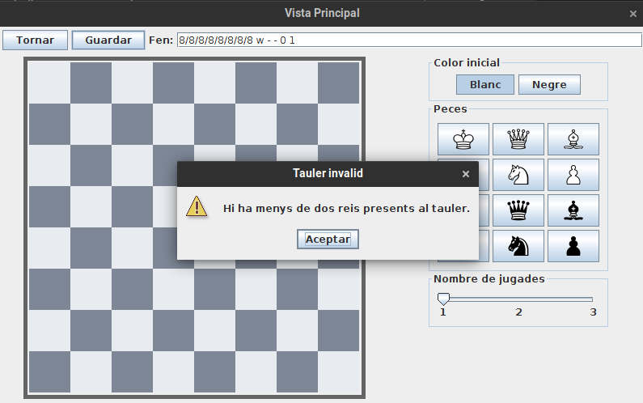

# JP3: Detecció d'errors al afegir un problema

## Tipus JP

Normal

## Efectes estudiats

L'editor verifica errors comuns.

## Entrada i Resposta esperada

Executar l'aplicació i entrar a Jugar -> Crear problema.

Prémer el botó guardar. Apareix un missatge d'error.

Introduir el següent FEN:

```
r2q2nr/5p1p/p1Bp3b/1p1NkP2/3pP1p1/2PP2P1/PP5P/R1Bb1RK1 w - - 0 1
```

Fer clic al botó de guardar i introduir com a nom "Test"

Apareix un missatge d'error.

Seleccionar el color negre i dues jugades.

Fer clic al botó de guardar i introduir com a nom "Test"

Tornarà a apareixer l'error.

Seleccionar el color blanc.

Fer clic al botó de guardar i introduir com a nom "Test_amb_barres"

Apareixerà un nou error.

Fer clic al botó de guardar i introduir com a nom "TestCompletat"

El problema es guarda correctament.

## Captures de pantalla de la sortida




