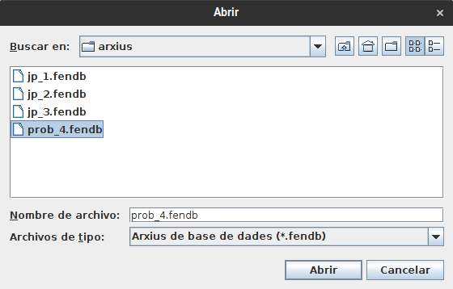
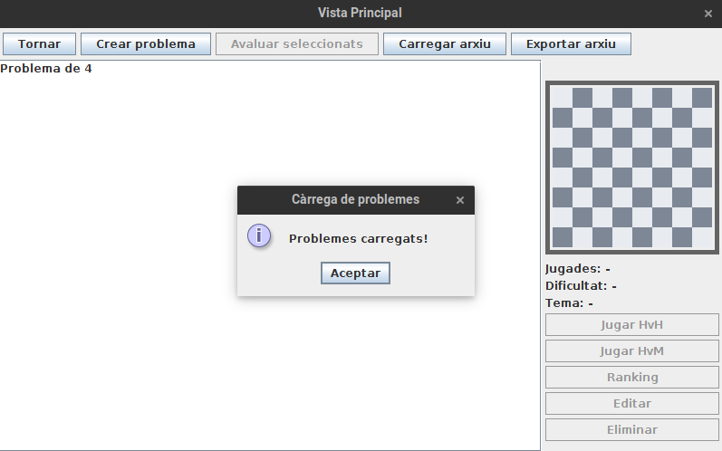
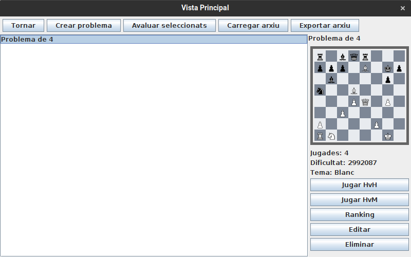

# JP4: Afegir problema de 4 moviments

## Tipus JP

Exigent

## Efectes estudiats

Es pot carregar a la base de dades un arxiu fendb amb un problema de 4 jugades.

## Entrada

Executar l'aplicació i entrar a Jugar.

Utilitzant l'opció 'Carregar arxiu' obrir l'arxius `prob_4.fendb` de la carpeta arxius associada a aquest joc de proves.

## Resposta esperada

Després un minut aproximadament, el problema "Problema de 4" apareixerà a la llista de problemes.

_NOTA: Aquest problema de 4 carrega ràpidament, hi ha altres que triguen més de 15 minuts._

## Captures de pantalla de la sortida

