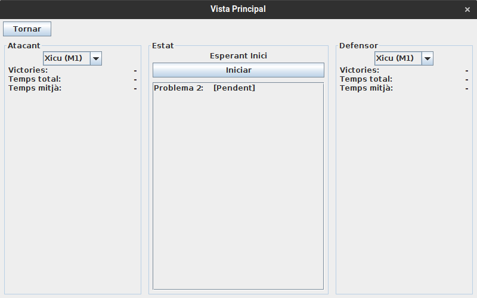
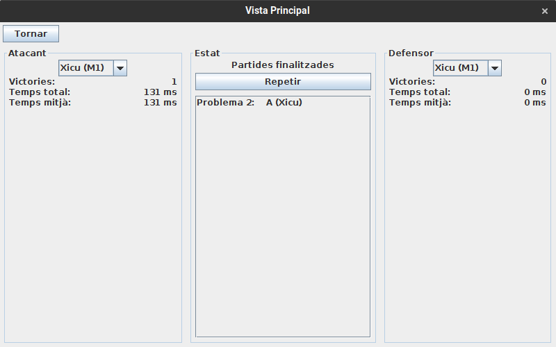

# JP1: Avaluar un sol problema

## Tipus JP

Simple

## Efectes estudiats

Es pot jugar una partida màquina contra màquina d'un problema i veure els resultats.

## Entrada

Abans d'executar l'aplicació, crear a la carpeta EXE (O la carpeta on es trobi el jar) una carpeta anomenada `bases` (Esborrar-la si ja existeix) i al seu interior copiar els continguts de `bases_JP` d'aquest directori.

Executar l'aplicació i entrar al menu de "Jugar".

Seleccionar "Problema 2" i fer clic a "Avaluar seleccionats". Fer clic a "Iniciar".

## Resposta esperada

Es juga la partida entre M1 i M1 i es mostren a pantalla els resultats. Guanya la M1 que ataca.

## Captures de pantalla de la sortida

