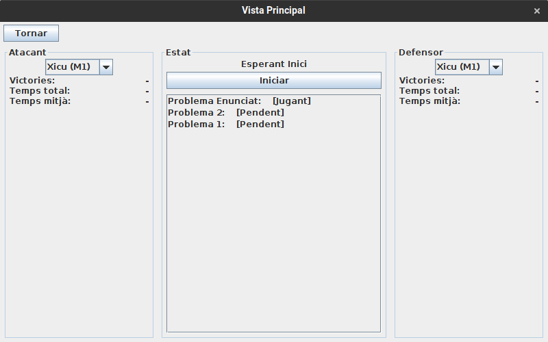
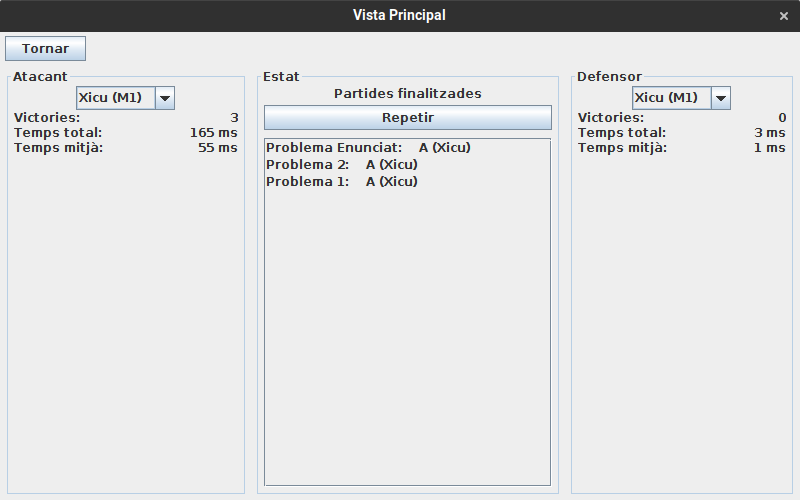

# JP2: Avaluar conjunt de problemes

## Tipus JP

Simple

## Efectes estudiats

Es poden jugar diverses partides màquina contra màquina sobre un conjunt de problemes i veure els resultats.

## Entrada

Abans d'executar l'aplicació, crear a la carpeta EXE (O la carpeta on es trobi el jar) una carpeta anomenada `bases` (Esborrar-la si ja existeix) i al seu interior copiar els continguts de `bases_JP` d'aquest directori.

Executar l'aplicació i entrar al menu de "Jugar".

Seleccionar "Problema 1", "Problema 2" i "Problema Enunciat" fent servir la tecla _shift_ o _control_
Fer clic a "Avaluar seleccionats". Després, fer clic a "Iniciar".

## Resposta esperada

Es juguen les partides entre M1 i M1 i es mostren a pantalla els resultats. La M1 atacant guanya sempre.

## Captures de pantalla de la sortida

