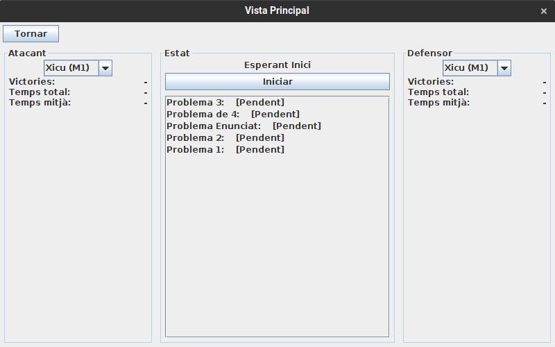
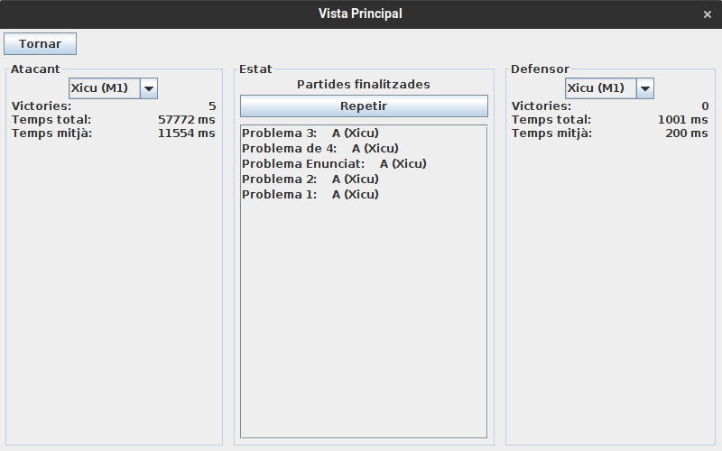
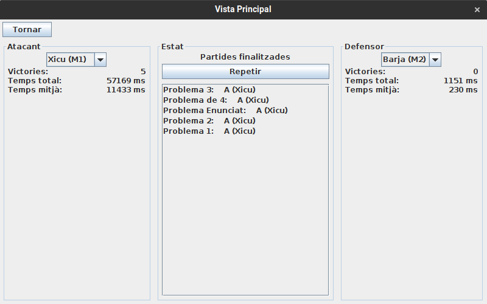
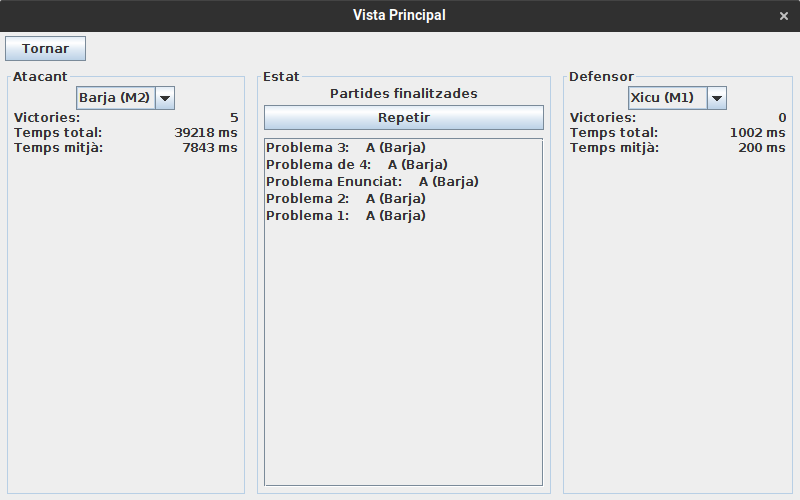
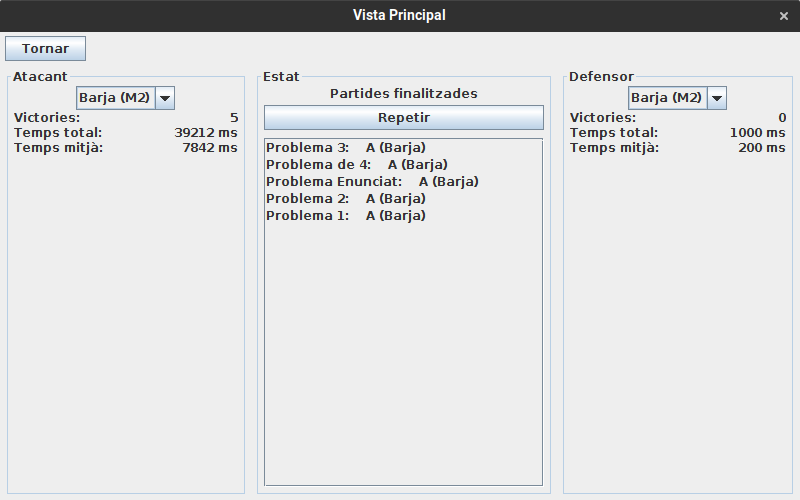

# JP4: Avaluar partides de 4 moviments

## Tipus JP

Exigent

## Efectes estudiats

Es poden jugar diverses partides màquina contra màquina sobre un conjunt de problemes i veure els resultats, amb problemes de 4 moviments.

## Entrada

Abans d'executar l'aplicació, crear a la carpeta EXE (O la carpeta on es trobi el jar) una carpeta anomenada `bases` (Esborrar-la si ja existeix) i al seu interior copiar els continguts de `bases_JP` d'aquest directori.

Executar l'aplicació i entrar al menu de "Jugar".

Seleccionar tots els problemes fent servir la tecla _shift_ o _control_
Fer clic a "Avaluar seleccionats". Després, fer clic a "Iniciar".

Seleccionar una a una cadascuna d'aquestes combinacions atacant-defensor, i fer clic a "Iniciar" o "Repetir" per a jugar les partides:

- M1 vs M1
- M1 vs M2
- M2 vs M1
- M2 vs M2

## Resposta esperada

Es juguen les partides entre les màquines i es mostren a pantalla els resultats.

L'atacant sempre guanya. Defensant, les dues maquines obtenen temps similars, però a l'hora d'atacar, el temps d'execució de M2 és un 30% menor.

## Captures de pantalla de la sortida

