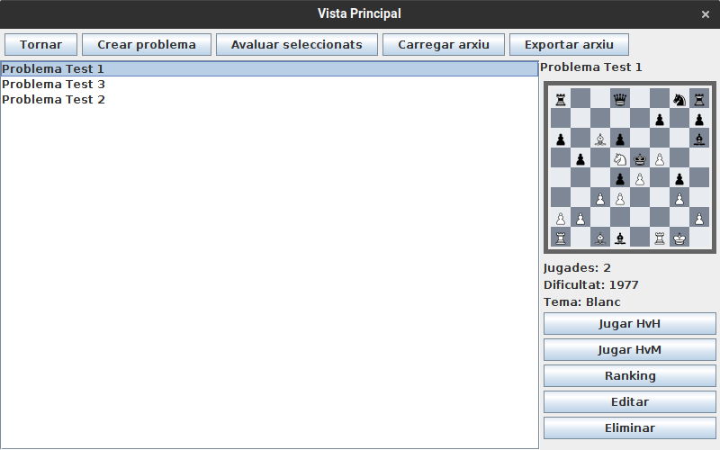

# JP1: Mostrar problemes de la base de dades

## Tipus JP

Simple

## Efectes estudiats

Es poden mostrar a pantalla els problemes de la base de dades.

## Entrada

Abans d'executar l'aplicació, crear a la carpeta EXE (O la carpeta on es trobi el jar) una carpeta anomenada `bases` (Esborrar-la si ja existeix) i al seu interior copiar els continguts de `bases_JP1` d'aquest directori.

Executar l'aplicació i anar seleccionant al menu de "Jugar" cadascun dels problemes de la llista.

## Resposta esperada

Quan es selecciona un problema, es mostra al lateral el seu tauler, així com informació sobre el seu tema, nombre de jugades i dificultat.

## Captures de pantalla de la sortida

