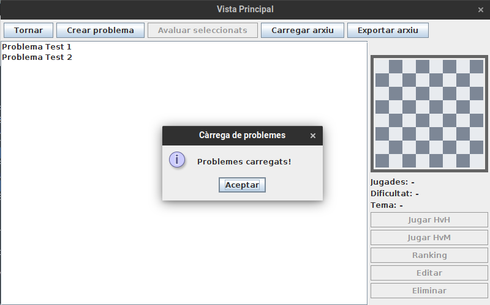
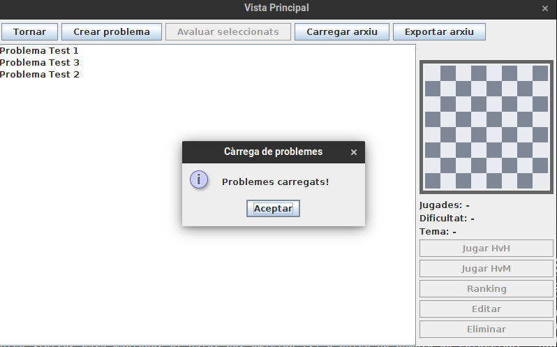
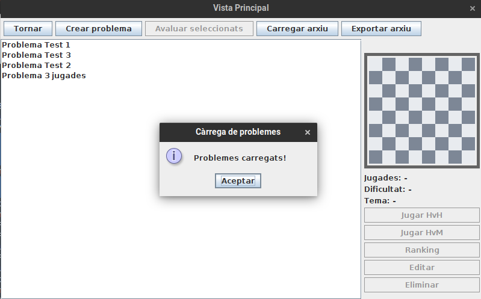

# JP2: Carregar arxiu de fens

## Tipus JP

Simple

## Efectes estudiats

Es pot carregar a la base de dades un arxiu fendb

## Entrada

Executar l'aplicació i entrar a Jugar.

Utilitzant l'opció 'Carregar arxiu' obrir un dels arxius `.fendb` de la carpeta arxius associada a aquest joc de proves.

- **jp_1.fendb:**
  Dos problemes de dos jugades
- **jp_2.fendb:**
  Tres problemes de dos jugades
- **jp_3.fendb:**
  Tres problemes de dos jugades i un de tres.

# Resposta esperada

El programa carrega els FENs de l'arxiu i els mostra a la llista. Es pot observar el tauler de cada fen al panel de la dreta després de seleccionar-lo fent-hi clic.

## Captures de pantalla de la sortida

