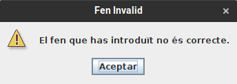

# JP3: Errors de carrega de FEN

## Tipus JP

Normal

## Efectes estudiats

S'introdueixen manualment diversos fens amb error de format per a comprovar que apareix un missatge d'error al validar.los.

## Entrada i resposta

Executar l'aplicació i entrar a Jugar -> Crear problema.

A la caixa de text superior introduir un a un el s següents FEN i prémer enter per a veure el tauler:

- Falta part final:

  ```
  8/8/8/8/8/8/8/8 w - -
  ```

- Color incorrecte:

  ```
  8/8/8/8/8/8/8/8 k - - 0 1
  ```

- Longitud incorrecta:
  ```
  8/9/8/8/8/8/8/8 w - - 0 1
  8/b6/8/8/8/8/8/8 w - - 0 1
  8/b8/8/8/8/8/8/8 w - - 0 1
  ```
- Rei duplicat:
  ```
  8/k7/k7/8/8/8/8/8 w - - 0 1
  ```

## Captures de pantalla de la sortida

Tots produeixen el següent missatge:

{ width=250px }
