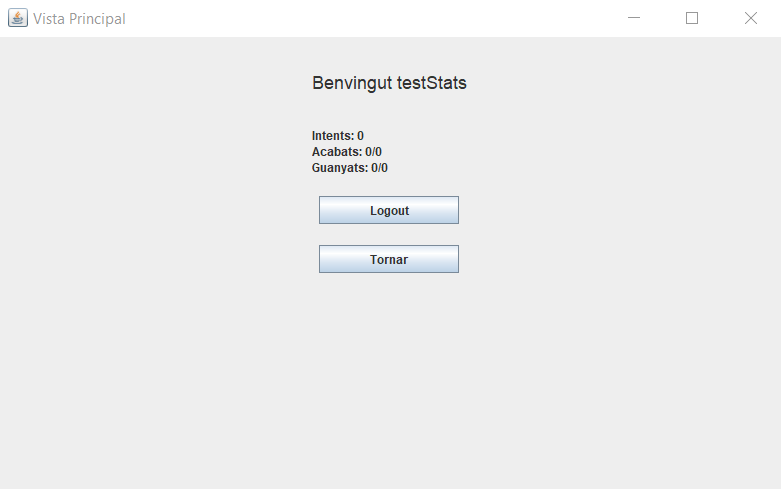

# JP1: Estadístiques buides

## Tipus JP

Simple

## Efectes estudiats

Es poden consultar les estadístiques d'un usuari recén creat.

## Entrada

Executar l'aplicació i entrar a la secció "Perfil". Fer clic al botó "Registrar-se".

Introduir les següents dades:

- **Usuari:** testStats
- **Contrasenya:** test
- **Confirma la pwd:** test

Fer clic al botó "Registrar".

## Resposta esperada

Les estadístiques inicialment estan totes a 0.

## Captures de pantalla de la sortida

