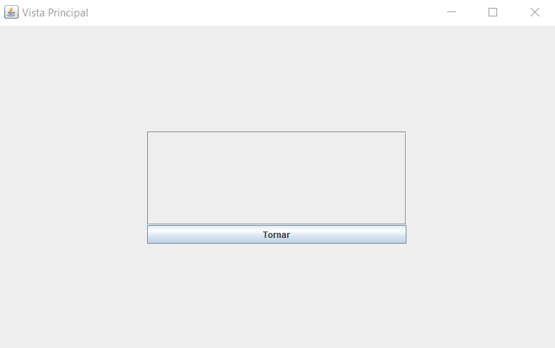

# JP1: Estadístiques buides

## Tipus JP

Simple

## Efectes estudiats

Es pot accedir al ranking buit d'un problema.

## Entrada

Abans d'executar l'aplicació, crear a la carpeta EXE (O la carpeta on es trobi el jar) una carpeta anomenada `bases` 
(esborrar-la si ja existeix) i al seu interior copiar els continguts de `bases_JP` d'aquest directori.

Executar l'aplicació i entrar a la secció "Jugar".

Seleccionar el problema `Problema Test`.

Fer clic al botó "Ranking".

## Resposta esperada

El ranking està buit.

## Captures de pantalla de la sortida

