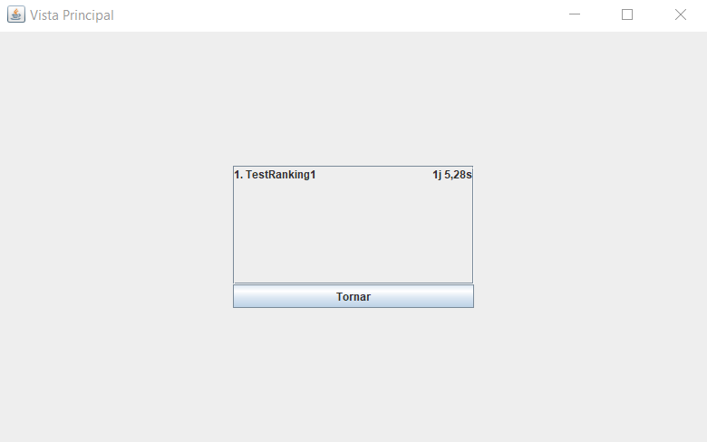
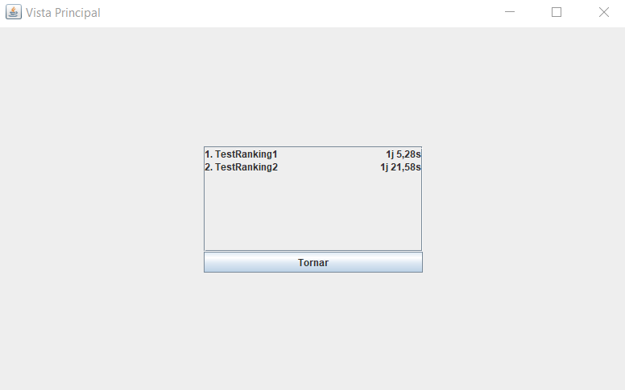
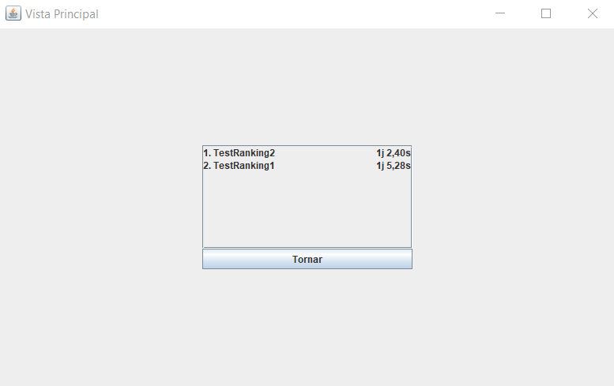
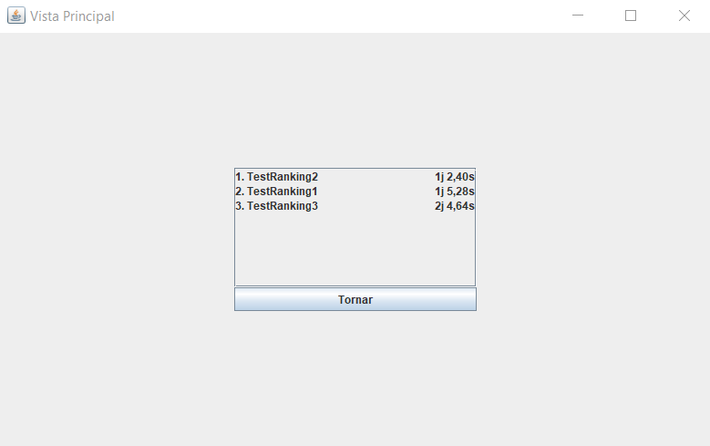

# JP2: Actualitzar Ranking

## Tipus JP

Normal

## Efectes estudiats

El ranking s'actualitza correctament.

## Entrada

Abans d'executar l'aplicació, crear a la carpeta EXE (O la carpeta on es trobi el jar) una carpeta anomenada `bases` 
(esborrar-la si ja existeix) i al seu interior copiar els continguts de `bases_JP` d'aquest directori.

Executar l'aplicació i entrar a la secció "Perfil".

Introduir les següents dades:

- **Usuari:** TestRanking1
- **Contrasenya:** test

Fer clic al botó "Login".

Fer clic al botó "Tornar".

Anar a la secció "Jugar", seleccionar el problema `Problema Test` i fer clic a 
"Jugar HvM" -> "Aceptar" -> "Atacar". Moure la torre a la columna del rei negre fent mat. Fer clic a "Veure ranking".

Tornar al menú principal (prement "Tornar") i repetir el mateix procediment fent a més el logout de l'usuari anterior, 
aquest cop amb nom d'usuari TestRanking2 al login. A més jugarem la partida lentament.

Tornar a jugar el mateix problema però amb més rapidesa.

Repetir el mateix procediment d'abans entrant amb l'usuari TestRanking3 aquest cop. A més, al jugar la partida, moure 
només el rei (conseqüentment no guanyant).

Finalment, tornarem a jugar amb el mateix usuari però movent la torre primer a la fila superior i després a la columna
del rei (fent mat en dues jugades).

## Resposta esperada

Les estadístiques s'actualitzen correctament, mostra els intents completats de `TestRanking1` i `TestRanking2`, 
`TestRanking2` millora els seus resultats, inicialment no mostra a `TestRanking3` i finalment el mostra també a 
l'última posició per haver fet 2 jugades.

## Captures de pantalla de la sortida

