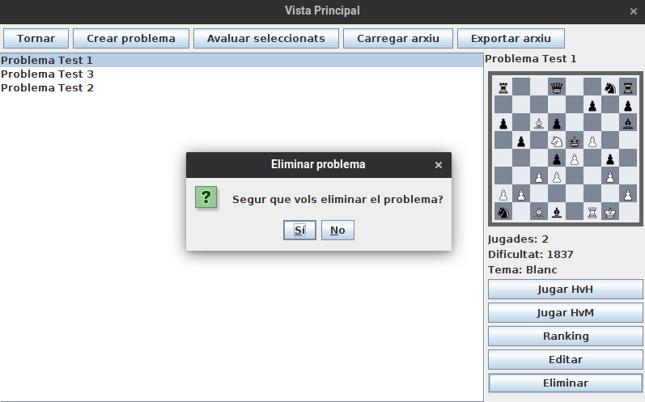
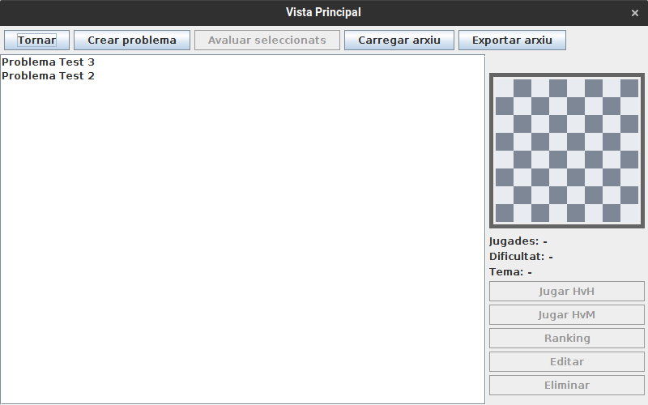

# JP1: Eliminar un problema de la base de dades

## Tipus JP

Simple

## Efectes estudiats

Es pot eliminar un problema de la base de dades.

## Entrada

Abans d'executar l'aplicació, crear a la carpeta EXE (O la carpeta on es trobi el jar) una carpeta anomenada `bases` (Esborrar-la si ja existeix) i al seu interior copiar els continguts de `bases_JP` d'aquest directori.

Executar l'aplicació i entrar al menu de "Jugar". Seleccionar el problema 1 i fer clic a eliminar.

Fer clic a "Si" a la finestra que apareix.

## Resposta esperada

El problema 1 es eliminat de la base de dades.

## Captures de pantalla de la sortida

