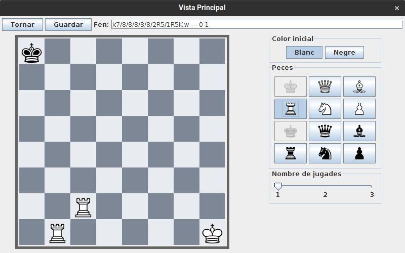

# JP1: Introducció manual d'un problema

## Tipus JP

Simple

## Efectes estudiats

Es pot introduir manualment un problema.

## Entrada

Executar l'aplicació i entrar a Jugar -> Crear problema.

Utilitzant els botons laterals, introduir:

- Rei negre a la casella superior esquerra
- Rei blanc a la casella inferior dreta
- Torre blanca a la segona casella inferior començant per l'esquerra
- Torre blanca a la diagonal superior dreta de l'anterior
- Reina negra a qualsevol punt del tauler

Tornar a fer clic a la reina negra per a esborrar-la.

# Resposta esperada

Les peces apareixen a la pantalla. El tauler queda com a la imatge associada.

## Captures de pantalla de la sortida

