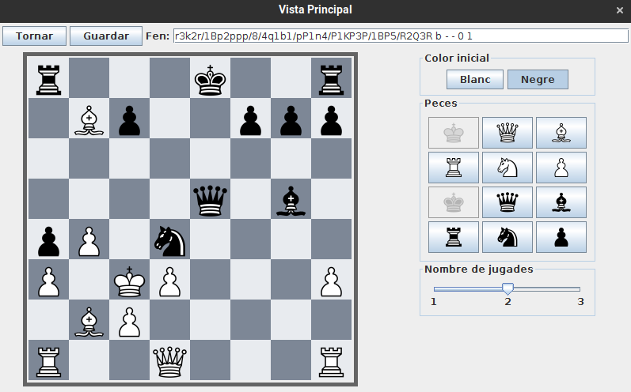
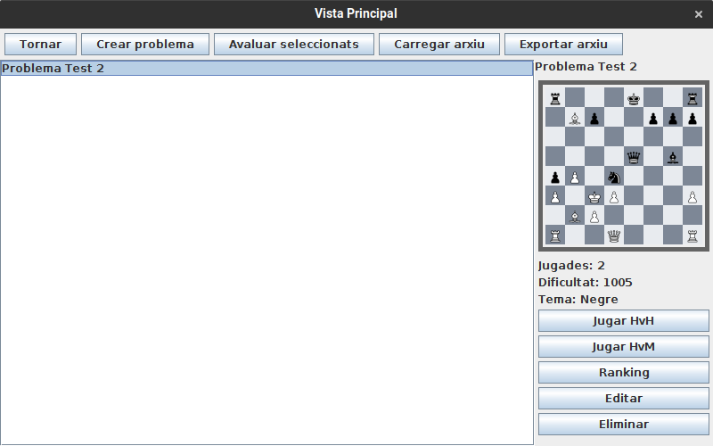

# JP2: Introducció manual d'un problema complex amb opcions

## Tipus JP

Normal

## Efectes estudiats

Es pot introduir manualment un problema complex, modificant opcions de color i nombre de jugades.

## Entrada

Executar l'aplicació i entrar a Jugar -> Crear problema.

Utilitzant els botons laterals, introduir el tauler mostrat a la figura:

{width=40%}

Seleccionar com a color 'negre'.

Moure el slider de nombre de jugades a 2

Fer clic al botó de guardar i introduir com a nom "Problema Test 2"

# Resposta esperada

Apareix a la llista de problemes un problema de nom "Problema test 2", amb el tauler introduit, color inicial negre, i dos jugades.

## Captures de pantalla de la sortida

