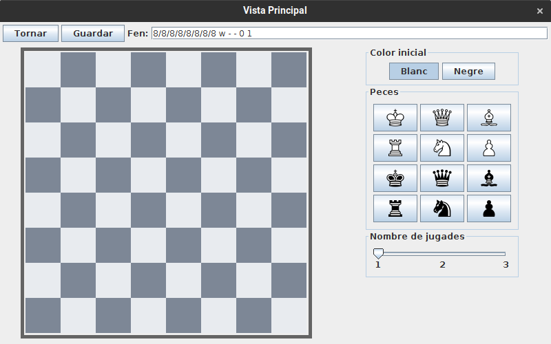
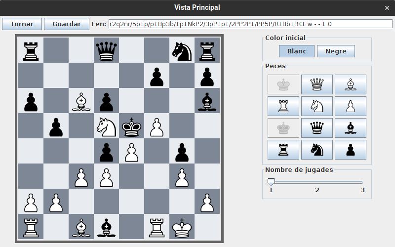
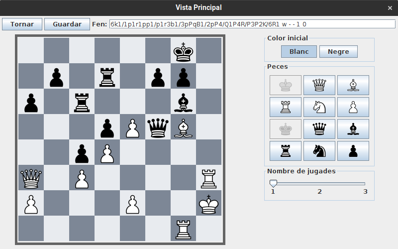
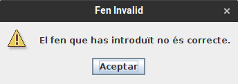

# JP1: Mostrar FEN a pantalla

## Preparació

Dirigir-se a la carpeta `EXE` i esborrar (si existeix) la carpeta `base`

```bash
> cd EXE
> rm -rf bases
```

## Execució

Executar Escacs.jar:

```bash
> java -jar Escacs.jar
```

Apareixerà la pantalla principal:


Seleccionar la opció `Jugar`, apareixerà una llista buida:


Sekeccionar la opció `Crear problema`, s'obrirà l'editor:



Ara podem procedir a executar els jocs de proves:

Per a executar-los, introduir els següents FENs a la caixa de text superior (marcada com a "Fen"), prémer enter i comprovar que la sortida coincideix amb la imatge.

### Jocs de proves senzills

```
r2q2nr/5p1p/p1Bp3b/1p1NkP2/3pP1p1/2PP2P1/PP5P/R1Bb1RK1 w - - 1 0
```



```
6k1/1p1r1pp1/p1r3b1/3pPqB1/2pP4/Q1P4R/P3P2K/6R1 w - - 1 0
```



```
r3k2r/1Bp2ppp/8/4q1b1/pP1n4/P1KP3P/1BP5/R2Q3R b - - 0 1
```


### Jocs de proves normals

Aquests jocs de proves proven l'aparició d'un missatge d'error:

Falta part final:

```
8/8/8/8/8/8/8/8 w - -
```

Color incorrecte:

```
8/8/8/8/8/8/8/8 k - - 0 1
```

Longitud incorrecta:

```
8/9/8/8/8/8/8/8 w - - 0 1
```

```
8/b6/8/8/8/8/8/8 w - - 0 1
```

```
8/b8/8/8/8/8/8/8 w - - 0 1
```

Rei duplicat:

```
8/k7/k7/8/8/8/8/8 w - - 0 1
```

Tots produeixen el següent missatge:

{ width=250px }
