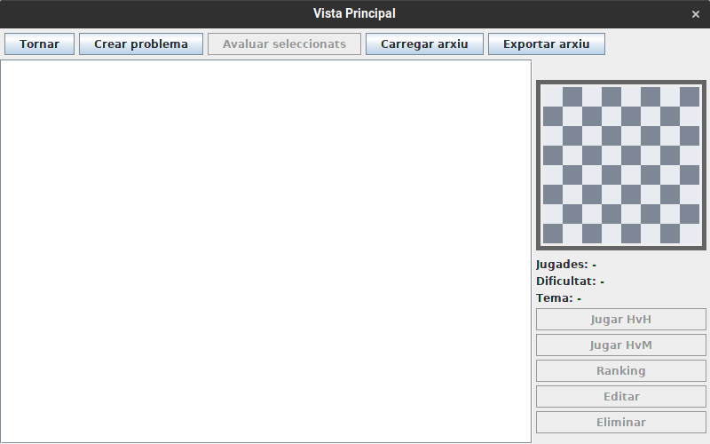

# JP2: Carregar arxiu de FENs

## Preparació

Dirigir-se a la carpeta `EXE` i esborrar (si existeix) la carpeta `base`

```bash
> cd EXE
> rm -rf bases
```

## Execució

Executar Escacs.jar:

```bash
> java -jar Escacs.jar
```

Apareixerà la pantalla principal:


Seleccionar la opció `Jugar`, apareixerà una llista buida:



Fer clic a `Carregar Arxiu`, apareixerà un buscador d'arxius, on cal seleccionar l'arxiu associat aj joc de proves.


Es carregaran els FENs de l'arxiu seleccionat. Comprovar comparant amb les captures de cada joc de proves.

Per a cada joc de proves, seguir el procediment anterior seleccionant l'arxiu donat.

### Jocs de proves senzills

```
jp_s_1.fendb
```

EN PROCES
