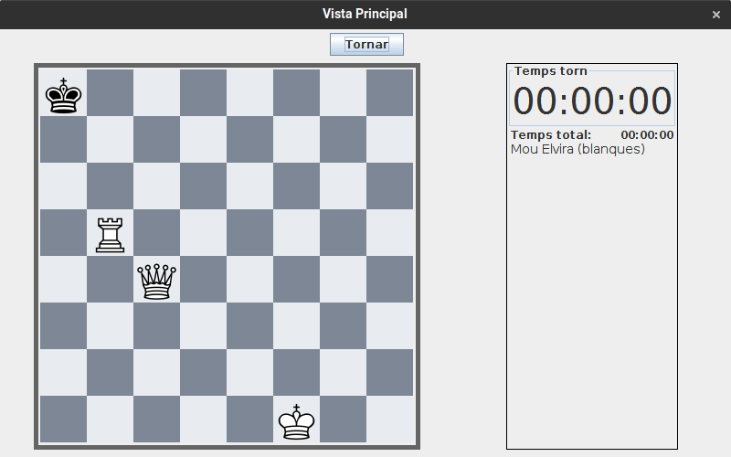

# JP2: Perdre partida humà contra humà

## Tipus JP

Simple

## Efectes estudiats

Es pot jugar i perdre una partida humà contra humà

## Entrada

Abans d'executar l'aplicació, crear a la carpeta EXE (O la carpeta on es trobi el jar) una carpeta anomenada `bases` (Esborrar-la si ja existeix) i al seu interior copiar els continguts de `bases_JP` d'aquest directori.

Executar el programa i iniciar sessió (a perfil) amb les següents dades:

- **Usuari:** Elvira
- **Contrasenya:** 1234

Seleccionar el problema "Problema 1" i prémer "Jugar HvH". Seleccionar com a nom de l'oponent "Edelmira".

S'iniciarà la partida. Fer clic a la reina. Es mostraràn les possibles destinacions. Seleccionar com a posició destí la casella de la dreta.

## Resposta esperada

Apareix la pantalla de victoria, indicant com a nom de jugador guanyador "Edelmira"

## Captures de pantalla de la sortida

