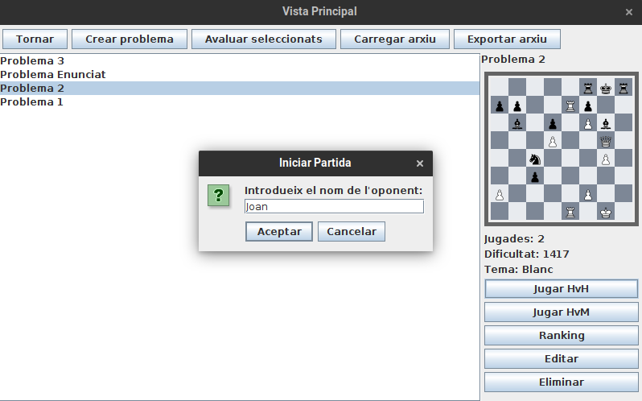
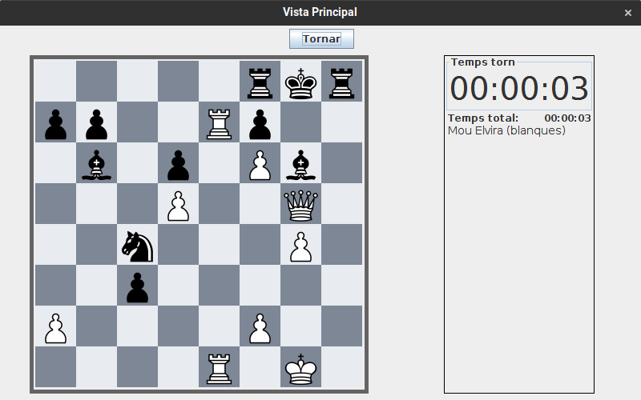
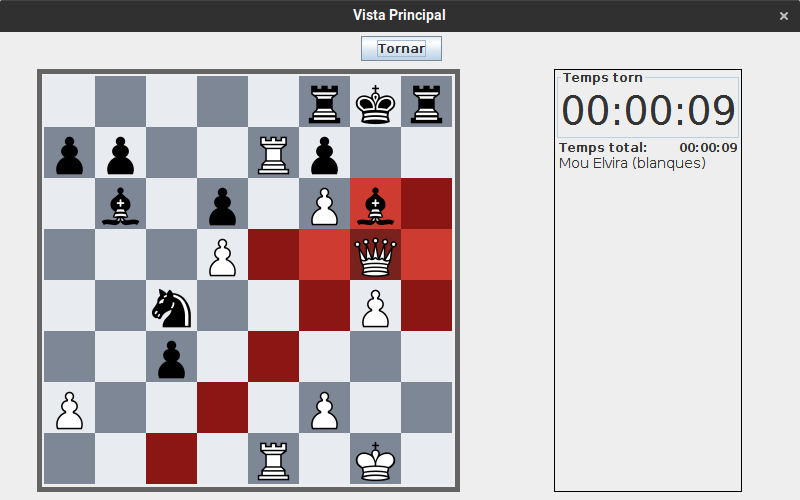
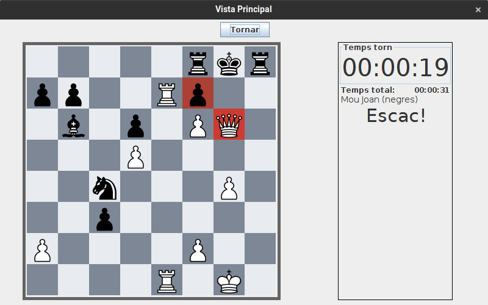
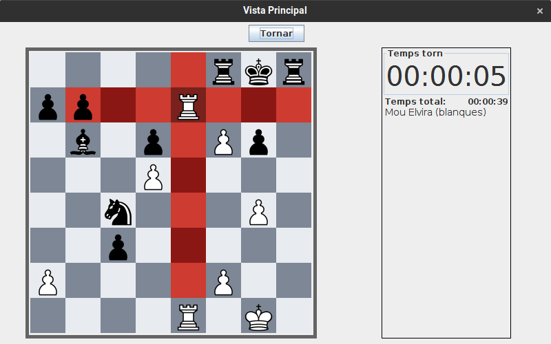

# JP2: Jugar partida humà contra humà de dos moviments

## Tipus JP

Normal

## Efectes estudiats

Es pot jugar una partida humà contra humà de dos moviments.

## Entrada

Abans d'executar l'aplicació, crear a la carpeta EXE (O la carpeta on es trobi el jar) una carpeta anomenada `bases` (Esborrar-la si ja existeix) i al seu interior copiar els continguts de `bases_JP` d'aquest directori.

Executar el programa i iniciar sessió (a perfil) amb les següents dades:

- **Usuari:** Elvira
- **Contrasenya:** 1234

Seleccionar el problema "Problema 2" i prémer "Jugar HvH". Seleccionar com a nom de l'oponent "Joan".

S'iniciarà la partida. Realitzar els següents moviments:

- Matar alfil negre amb reina blanca
- Matar reina blanca amb peó. _(Comprovar que aquest és l'unic moviment possible)_
- Colocar torre blanca davant del rei negre

## Resposta esperada

Apareix la pantalla de victoria, indicant com a nom de jugador guanyador "Edelmira"

## Captures de pantalla de la sortida

