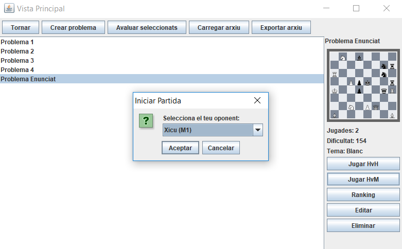
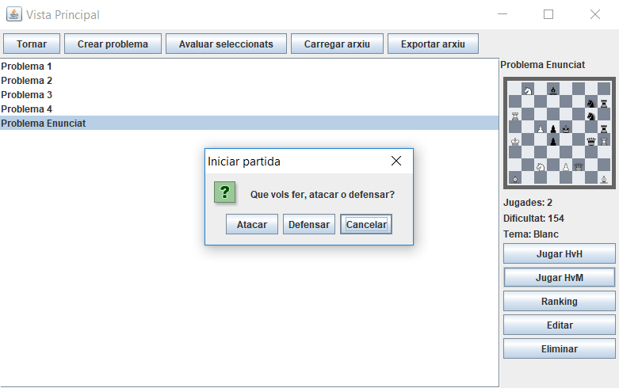
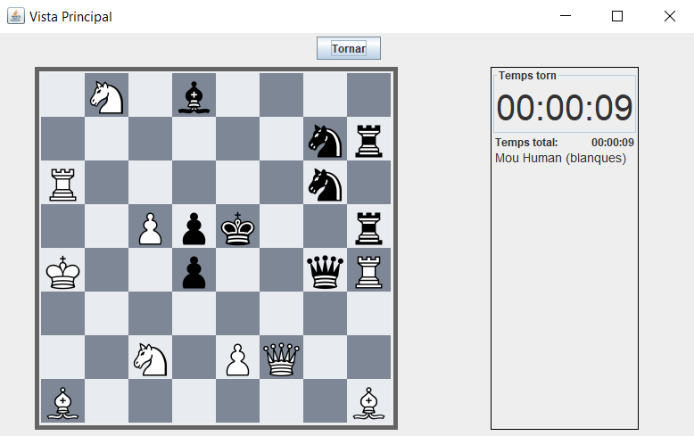
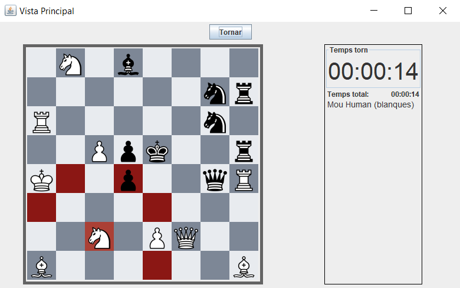
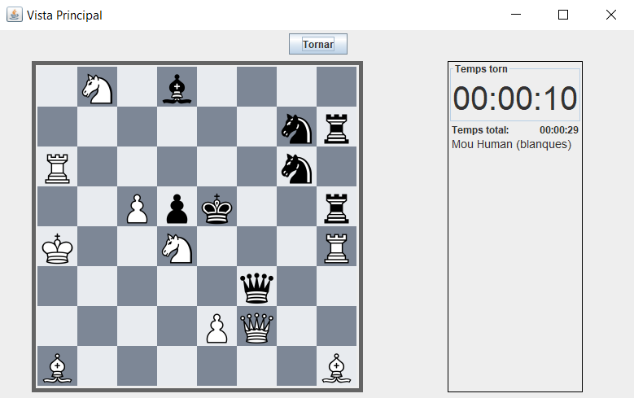
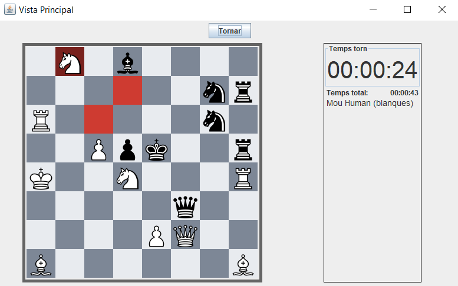
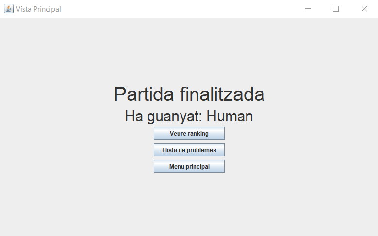
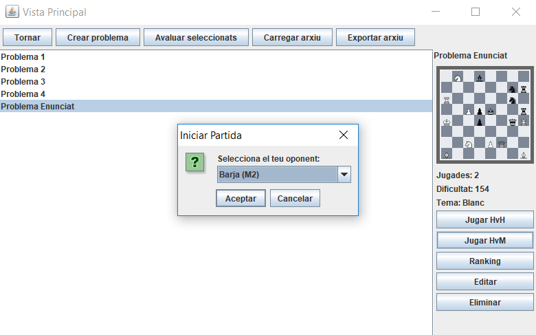

# JP10: Jugar partida humà contra màquina al problema de l'enunciat

## Tipus JP

Normal

## Efectes estudiats

Es pot jugar i guanyar una partida humà contra màquina al problema de l'enunciat.

## Entrada

Abans d'executar l'aplicació, crear a la carpeta EXE (O la carpeta on es trobi el jar) una carpeta anomenada `bases` (Esborrar-la si ja existeix) i al seu interior copiar els continguts de `bases_JP` d'aquest directori.

Executar el programa i iniciar sessió (a perfil) amb les següents dades:

- **Usuari:** Human
- **Contrasenya:** 1234

Seleccionar el problema "Problema Enunciat" i prémer "Jugar HvM". Seleccionar com a oponent a "Xicu (M1)". Prémer "Atacar".

S'iniciarà la partida. Realitzar els següents moviments:

- Matar el peó amb el cavall
- Segons el que hagi fet la màquina (tot i que no els cobrirem totes):
    - Si posa la reina davant de la nostra o menja el peó (entre d'altres jugades) fer mat movent el cavall de més a l'esquerra a la segona fila des de dalt.
    - Si menja el cavall, fer mat menjant amb l'alfil la seva reina.
    - Hi ha moltes combinacions, tot i així, facin el que facin les negres les blanques tenen mat en una jugada. Fer aquesta jugada.

Repetir el procediment seleccionant a "Barja (M2)" com oponent.

## Resposta esperada

Apareix la pantalla de victoria, indicant com a nom de jugador guanyador "Human".

Apareix la pantalla de victoria, indicant com a nom de jugador guanyador "Human".

## Captures de pantalla de la sortida

