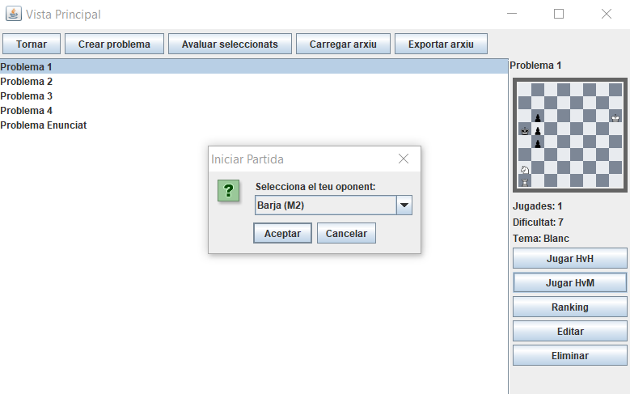
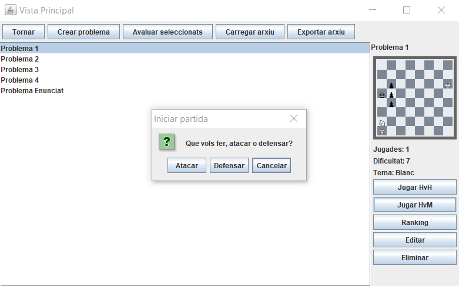
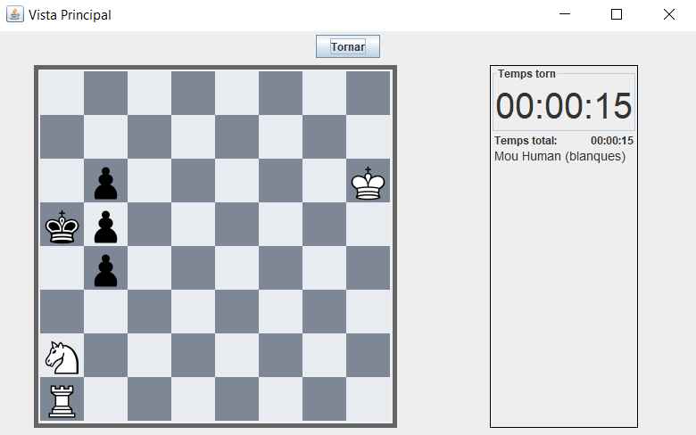
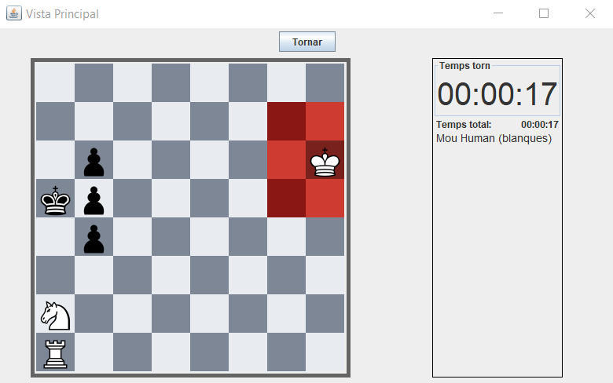

# JP3: Perdre partida humà contra màquina 1

## Tipus JP

Simple

## Efectes estudiats

Es pot jugar i perdre una partida humà contra M2 atacant.

## Entrada

Abans d'executar l'aplicació, crear a la carpeta EXE (O la carpeta on es trobi el jar) una carpeta anomenada `bases` (Esborrar-la si ja existeix) i al seu interior copiar els continguts de `bases_JP` d'aquest directori.

Executar el programa i iniciar sessió (a perfil) amb les següents dades:

- **Usuari:** Human
- **Contrasenya:** 1234

Seleccionar el problema "Problema 1" i prémer "Jugar HvM". Seleccionar Xicu(M1) com oponent. Prémer "Atacar".

S'iniciarà la partida. Fer clic al rei. Es mostraran les possibles destinacions. Seleccionar com a posició destí qualsevol.

## Resposta esperada

Apareix la pantalla de victoria, indicant com a nom de jugador guanyador "Xicu".

## Captures de pantalla de la sortida

