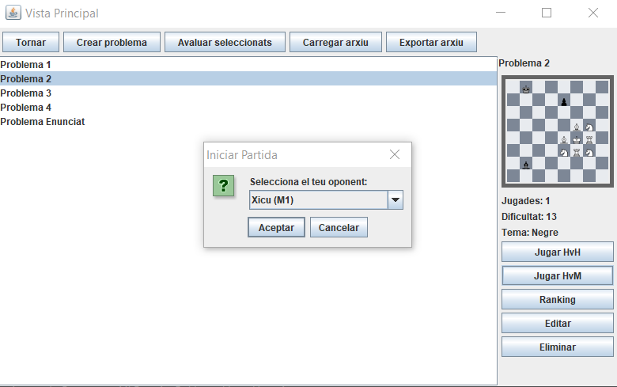
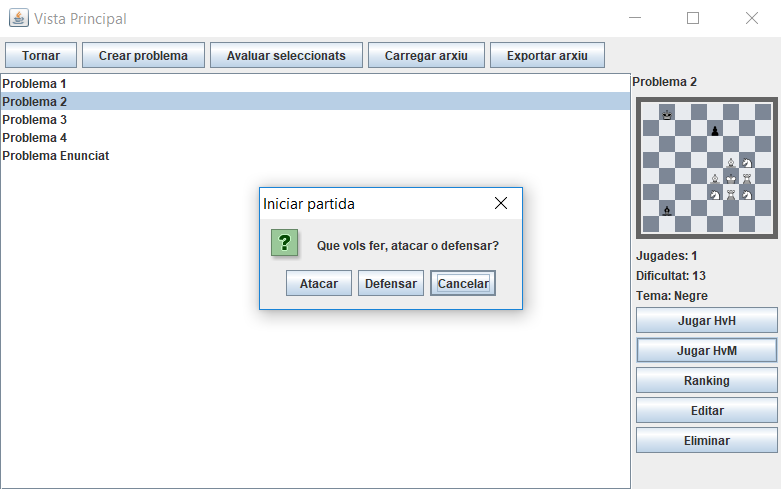
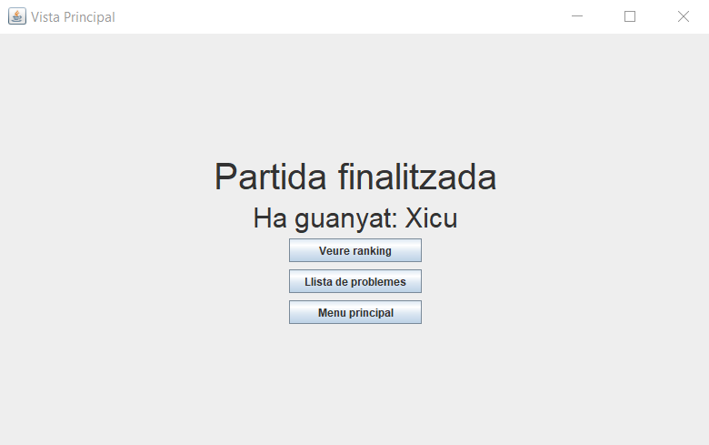
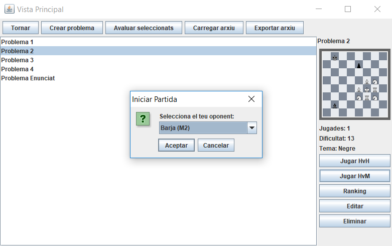
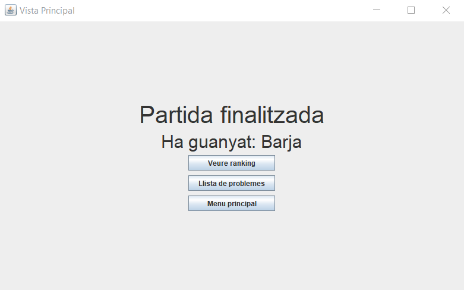

# JP3: Partida humà vs màquina com a defensor

## Tipus JP

Simple

## Efectes estudiats

Es pot jugar una partida contra la màquina sent defensor.

## Entrada

Abans d'executar l'aplicació, crear a la carpeta EXE (O la carpeta on es trobi el jar) una carpeta anomenada `bases` (Esborrar-la si ja existeix) i al seu interior copiar els continguts de `bases_JP` d'aquest directori.

Executar el programa i iniciar sessió (a perfil) amb les següents dades:

- **Usuari:** Human
- **Contrasenya:** 1234

Seleccionar el problema "Problema 2" i prémer "Jugar HvM". Seleccionar Xicu(M1) com oponent. Prémer "Defensar". 
S'iniciarà la partida i la màquina farà el seu moviment (al ser un problema d'una jugada s'arribarà directament a la pantalla final).

Seleccionar un altre cop el problema "Problema 2" i prémer "Jugar HvM". Seleccionar Barja(M2) com oponent. Prémer "Defensar". 
S'iniciarà la partida i la màquina farà el seu moviment (al ser un problema d'una jugada s'arribarà directament a la pantalla final).

## Resposta esperada

Apareix la pantalla de victoria, indicant com a nom de jugador guanyador "Xicu".

Apareix la pantalla de victoria, indicant com a nom de jugador guanyador "Barja".

## Captures de pantalla de la sortida

