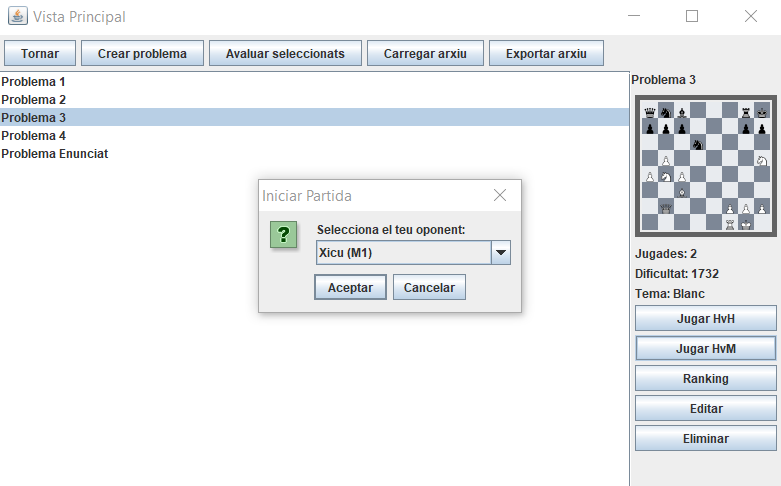
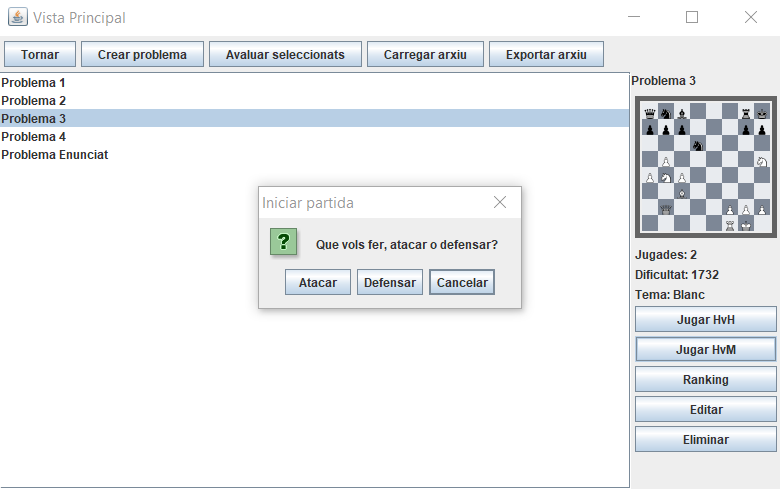
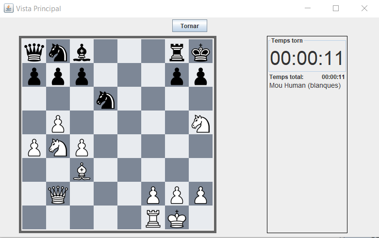
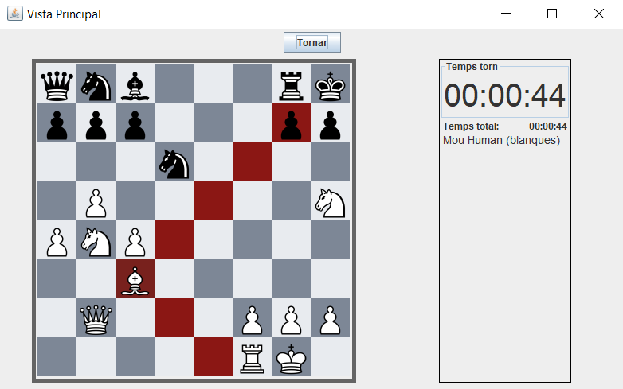
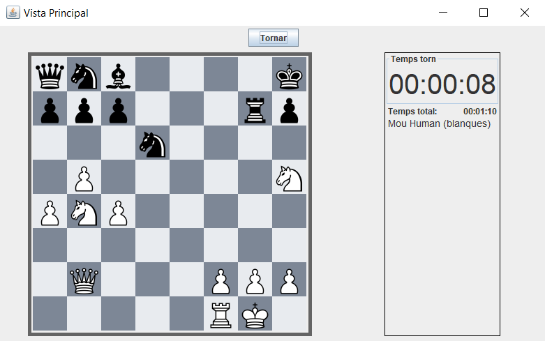
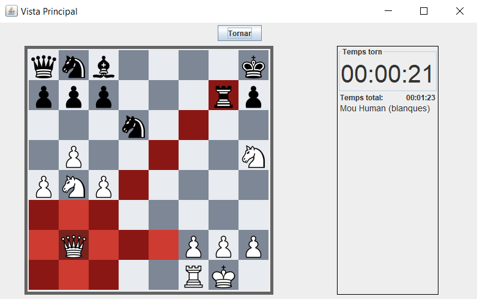
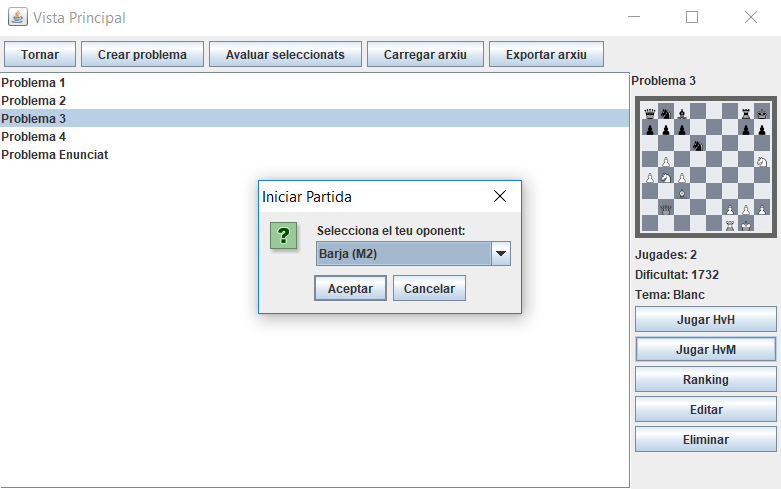

# JP6: Jugar partida humà contra màquina de dos moviments

## Tipus JP

Normal

## Efectes estudiats

Es pot jugar i guanyar una partida humà contra màquina de dos moviments atacant.

## Entrada

Abans d'executar l'aplicació, crear a la carpeta EXE (O la carpeta on es trobi el jar) una carpeta anomenada `bases` (Esborrar-la si ja existeix) i al seu interior copiar els continguts de `bases_JP` d'aquest directori.

Executar el programa i iniciar sessió (a perfil) amb les següents dades:

- **Usuari:** Human
- **Contrasenya:** 1234

Seleccionar el problema "Problema 3" i prémer "Jugar HvM". Seleccionar com a oponent a "Xicu (M1)". Prémer "Atacar".

S'iniciarà la partida. Realitzar els següents moviments:

- Matar el peó amb l'alfil. -> La màquina menja amb la torre (única jugada possible).
- Matar la torre amb la reina.

Repetir el procediment seleccionant a "Barja (M2)" com oponent.

## Resposta esperada

Apareix la pantalla de victoria, indicant com a nom de jugador guanyador "Human".

Apareix la pantalla de victoria, indicant com a nom de jugador guanyador "Human".

## Captures de pantalla de la sortida

