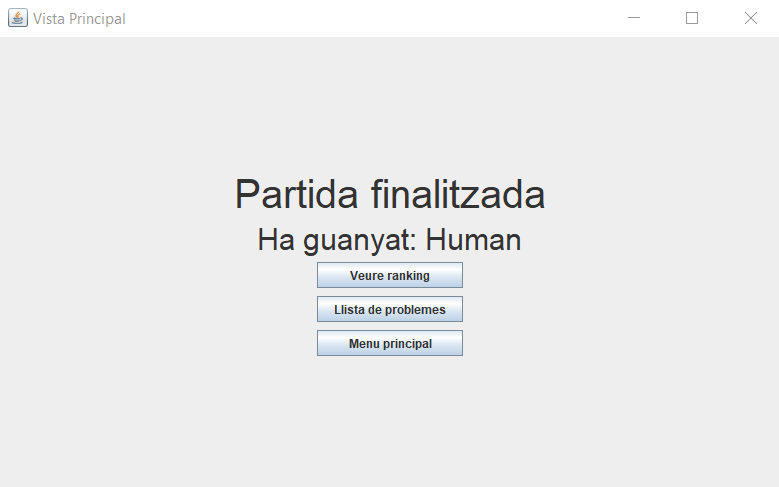

# JP8: Jugar partida humà contra màquina de tres moviments

## Tipus JP

Normal

## Efectes estudiats

Es pot jugar i guanyar una partida humà contra màquina de tres moviments atacant.

## Entrada

Abans d'executar l'aplicació, crear a la carpeta EXE (O la carpeta on es trobi el jar) una carpeta anomenada `bases` (Esborrar-la si ja existeix) i al seu interior copiar els continguts de `bases_JP` d'aquest directori.

Executar el programa i iniciar sessió (a perfil) amb les següents dades:

- **Usuari:** Human
- **Contrasenya:** 1234

Seleccionar el problema "Problema 4" i prémer "Jugar HvM". Seleccionar com a oponent a "Xicu (M1)". Prémer "Atacar".

S'iniciarà la partida. Realitzar els següents moviments:

- Matar el peó del costat del rei amb la reina (de dalt) fent escac.
- Segons el que hagi fet la màquina:
    - Si la màquina menja amb el cavall, menjar el cavall amb la reina.
    La màquina mou el rei a l'esquerra (única) i fer mat movent la reina a l'última casella de la columna
    - Si la màquina mou el rei a la esquerra, moure la dama a l'última casella de la fila. 
    La màquina es taparà amb el cavall (única) i fer mat movent l'altre reina dos caselles sota la de la cantonada (en diagonal al rei).

Repetir el procediment seleccionant a "Barja (M2)" com oponent.

## Resposta esperada

Apareix la pantalla de victoria, indicant com a nom de jugador guanyador "Human".

Apareix la pantalla de victoria, indicant com a nom de jugador guanyador "Human".

## Captures de pantalla de la sortida

