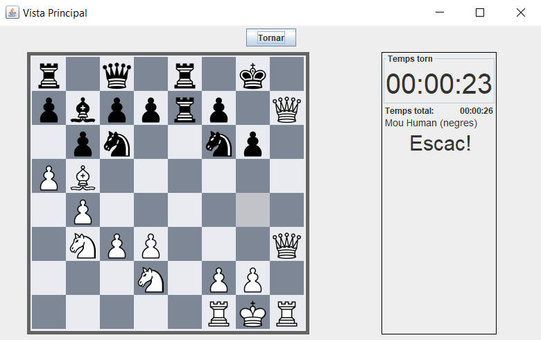
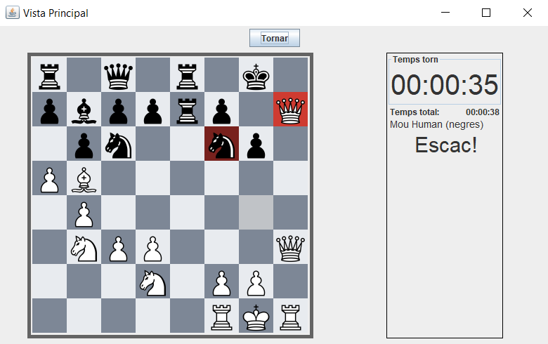
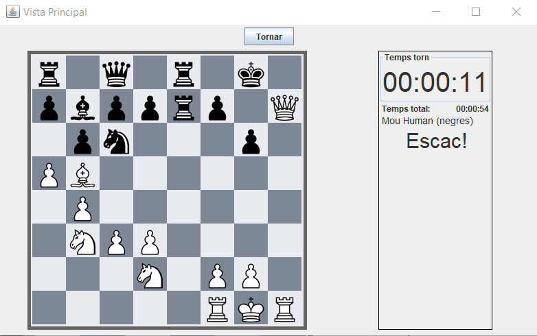
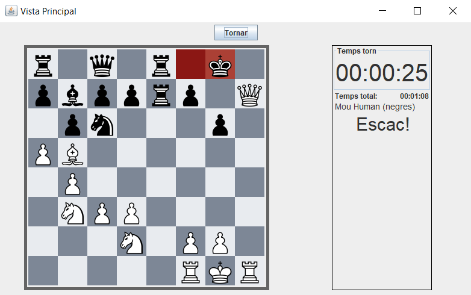
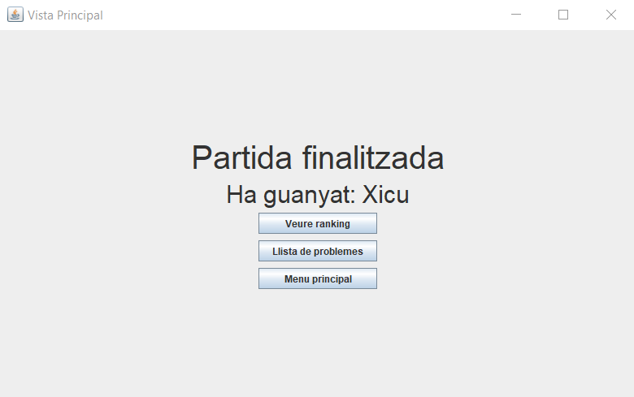
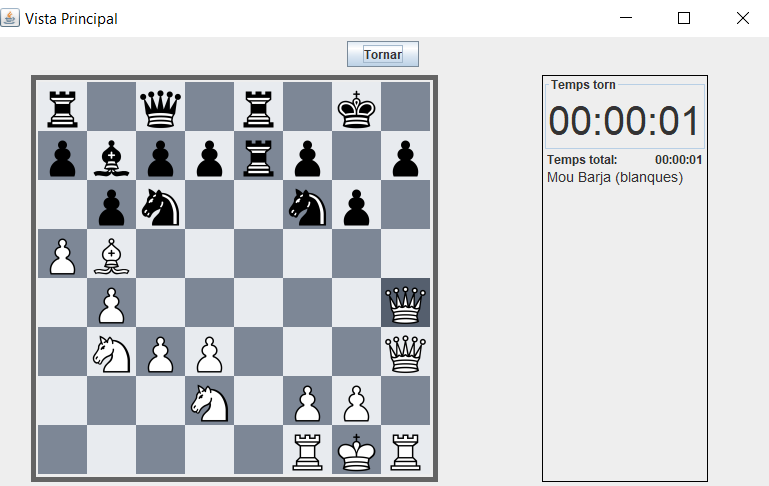
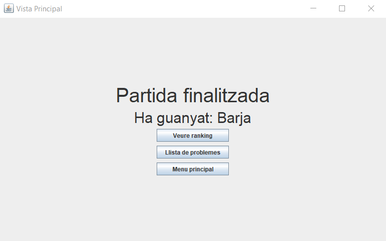

# JP9: Jugar partida de tres moviments humà defensant contra màquina

## Tipus JP

Normal

## Efectes estudiats

Es pot jugar una partida humà contra màquina de tres moviments defensant.

## Entrada

Abans d'executar l'aplicació, crear a la carpeta EXE (O la carpeta on es trobi el jar) una carpeta anomenada `bases` (Esborrar-la si ja existeix) i al seu interior copiar els continguts de `bases_JP` d'aquest directori.

Executar el programa i iniciar sessió (a perfil) amb les següents dades:

- **Usuari:** Human
- **Contrasenya:** 1234

Seleccionar el problema "Problema 4" i prémer "Jugar HvM". Seleccionar com a oponent a "Xicu (M1)". Prémer "Defensar".

S'iniciarà la partida. La màquina menjarà el peó amb la dama fent escac. Realitzar el següent moviment:

- Menjar la dama amb el cavall. -> la màquina menjarà el cavall amb la dama fent escac.
- Moure el rei a l'esquerra. -> la màquina farà mat.

Repetir el procediment seleccionant a "Barja (M2)" com oponent.

## Resposta esperada

Apareix la pantalla de victoria, indicant com a nom de jugador guanyador "Xicu".

Apareix la pantalla de victoria, indicant com a nom de jugador guanyador "Barja".

## Captures de pantalla de la sortida

