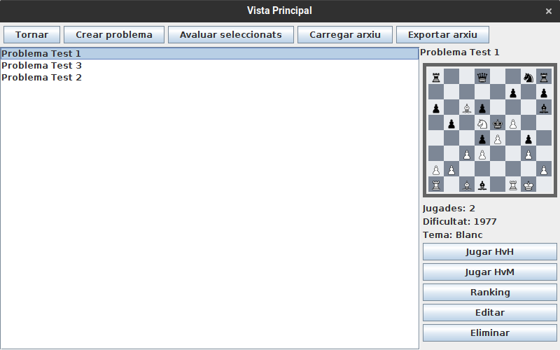

# JP1: Mostrar la llista de problemes

## Tipus JP

Simple

## Efectes estudiats

Es poden mostrar a pantalla els problemes de la base de dades.

## Entrada

Abans d'executar l'aplicació, crear a la carpeta EXE (O la carpeta on es trobi el jar) una carpeta anomenada `bases` (Esborrar-la si ja existeix) i al seu interior copiar els continguts de `bases_JP1` d'aquest directori.

Executar l'aplicació i entrar al menu de "Jugar".

## Resposta esperada

Es presenta a pantalla una llista amb els tres problemes de la base de dades.

## Captures de pantalla de la sortida

