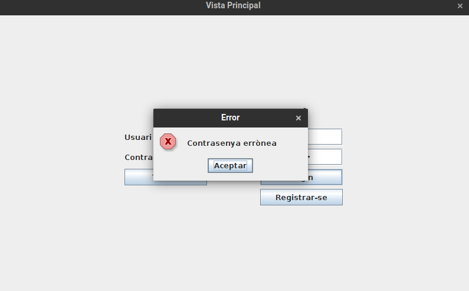
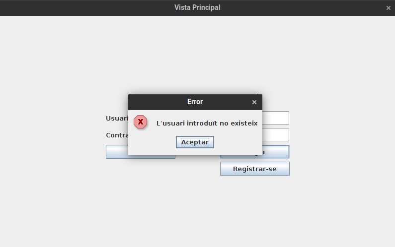

# JP1: Errors durant login

## Tipus JP

Simple

## Efectes estudiats

El programa comprova correctament els errors que es poden produir durant el login.

## Entrada

Abans d'executar l'aplicació, crear a la carpeta EXE (O la carpeta on es trobi el jar) una carpeta anomenada `bases` (Esborrar-la si ja existeix) i al seu interior copiar els continguts de `bases_JP` d'aquest directori.

Executar l'aplicació i entrar a la secció "Perfil".

Intrroduir les següents dades:

- **Usuari:** test
- **Contrasenya:** aquestanoeslacontrasenya

Fer clic al botó "Login". Apareixerà un error.

Intrroduir les següents dades:

- **Usuari:** Elvira
- **Contrasenya:** test

Fer clic al botó "Login". Apareixerà un error.

## Resposta esperada

S'inicia la sessió de l'usiari "test", mostrant-se el seu perfil.

## Captures de pantalla de la sortida

