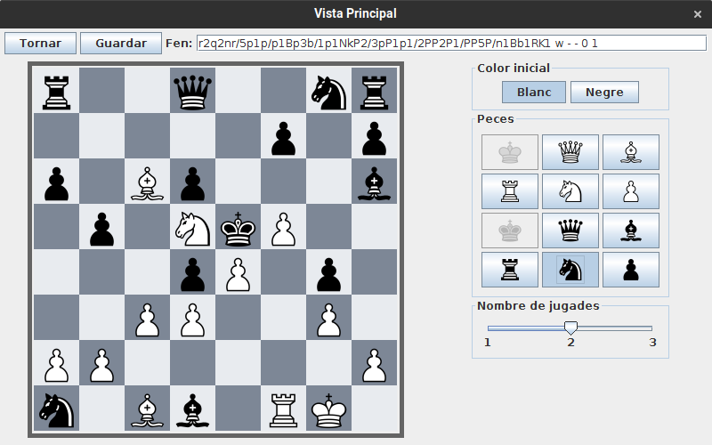

# JP1: Modificar un problema

## Tipus JP

Simple

## Efectes estudiats

Es pot modificar un problema de la base de dades.

## Entrada

Abans d'executar l'aplicació, crear a la carpeta EXE (O la carpeta on es trobi el jar) una carpeta anomenada `bases` (Esborrar-la si ja existeix) i al seu interior copiar els continguts de `bases_JP` d'aquest directori.

Executar l'aplicació i entrar al menu de "Jugar". Seleccionar el problema 1 i fer clic al botó "Editar" del menu lateral.

Fer clic a la torre blanca de la casella inferior esquerra per a esborrar-la, posar al seu lloc un cavall negre seleccionant-lo al menu lateral i després fent clic a la casella. Guardar el tauler.

## Resposta esperada

Es guarda la modificació de la partida a la base de dades.

## Captures de pantalla de la sortida

