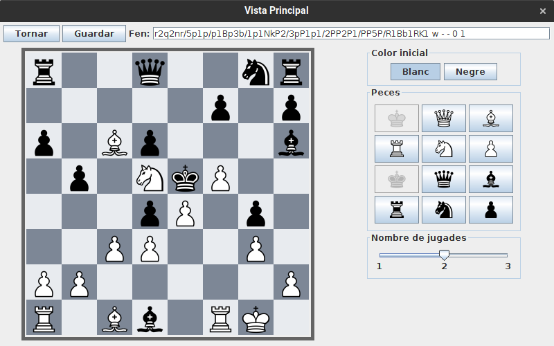

# JP2: Detecció d'errors en la modificació

## Tipus JP

Normal

## Efectes estudiats

Es detecten errors comuns al modificar un problema.

## Entrada

Abans d'executar l'aplicació, crear a la carpeta EXE (O la carpeta on es trobi el jar) una carpeta anomenada `bases` (Esborrar-la si ja existeix) i al seu interior copiar els continguts de `bases_JP` d'aquest directori.

Executar l'aplicació i entrar al menu de "Jugar". Seleccionar el problema 1 i fer clic al botó "Editar" del menu lateral.

Modificar el nombre de jugades a 1 i prémer guardar. Apareixerà un missatge d'error.

Tornar a posar el nombre de jugades a 2 i esborrar el rei blanc fent-hi clic. Al prémer guardar apareixerà un nou error.

## Resposta esperada

Apareixen els errors esmentats.

## Captures de pantalla de la sortida

