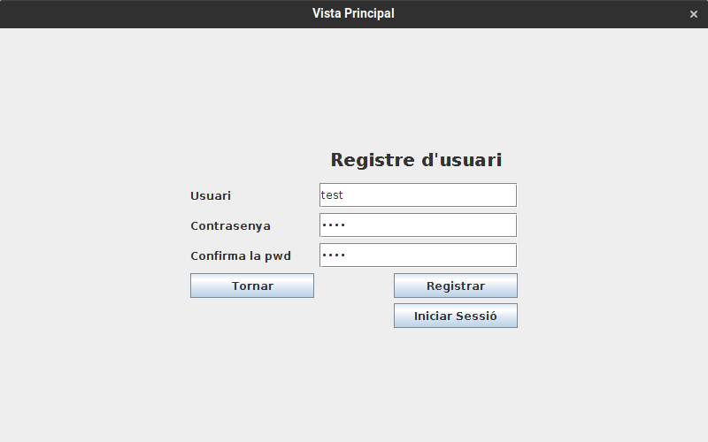

# JP1: Registre d'usuari

## Tipus JP

Simple

## Efectes estudiats

Es pot registrar un usuari en el sistema.

## Entrada

Executar l'aplicació i entrar a la secció "Perfil". Fer clic al botó "Registrar-se".

Intrroduir les següents dades:

- **Usuari:** test
- **Contrasenya:** test
- **Confirma la pwd:** test

Fer clic al botó "Registrar".

## Resposta esperada

L'usuari "test" es registra al sistema i es mostra el seu perfil.

## Captures de pantalla de la sortida

