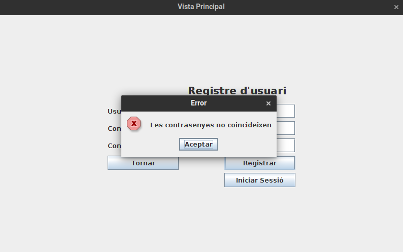
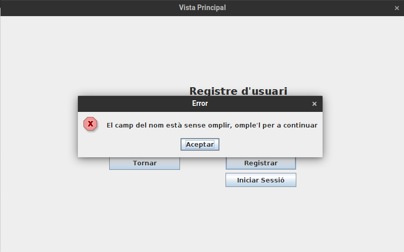
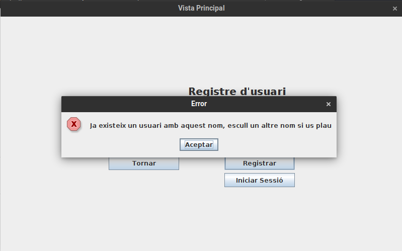

# JP2: Errors de registre d'usuari

## Tipus JP

Normal

## Efectes estudiats

Es mostren els errors adients durant el procés de registre d'usuari.

## Entrada

Executar l'aplicació i entrar a la secció "Perfil". Fer clic al botó "Registrar-se".

Intrroduir les següents dades:

- **Usuari:** test
- **Contrasenya:** test
- **Confirma la pwd:** test2

Fer clic al botó "Registrar". Apareixerà un error.

- **Usuari:** _(Deixar buit)_
- **Contrasenya:** test
- **Confirma la pwd:** test

Fer clic al botó "Registrar". Apareixerà un error.

Intrroduir les següents dades:

- **Usuari:** test
- **Contrasenya:** test
- **Confirma la pwd:** test

Fer clic al botó "Registrar". Seguidament fer clic a "Logout".

Tornar a fer clic al botó "Registrar-se" i introduir de nou les dades anteriors.

Fer clic al botó "Registrar". Apareixerà un error.

## Resposta esperada

Apareixen els missatges d'error perinents.

## Captures de pantalla de la sortida

